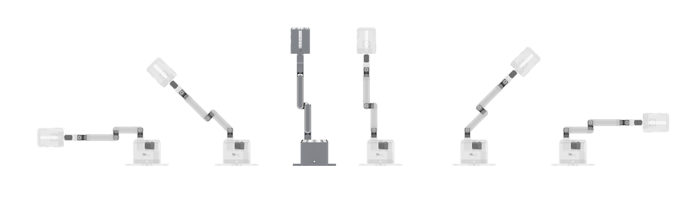

# CASA0022_ProjecTo - Intelligent Interactive Projection System

<div align="center">



**Professional Intelligent Interactive Projection Robotic Arm System Based on LeRobot Framework**

[](https://opensource.org/licenses/MIT)
[](https://www.python.org/downloads/)
[](https://github.com/huggingface/lerobot)
[](https://www.riverbankcomputing.com/software/pyqt/)

[Quick Start](#-quick-start) • [Technical Features](#-technical-features) • [System Architecture](#-system-architecture) • [Installation](#-installation) • [Documentation](#-documentation)

</div>

## 📋 System Overview


CASA0022_ProjecTo is an intelligent exhibition interactive system developed based on PyQt6, integrating multiple technologies including computer vision, robotic arm control, and human-computer interaction. The system adopts a multi-stage interactive design, achieving natural and intuitive human-computer interaction through precise gesture recognition and object detection, providing an immersive intelligent interactive experience for exhibition scenarios.

### ✨ Core Features

#### 🎯 Precise Gesture Recognition
- **MediaPipe-based Technology**: Supports multiple gestures including OK gesture, waving, double-finger tap, single-finger long press
- **Real-time Detection**: Response delay < 100ms, accuracy > 95%
- **Intelligent Optimization**: Processing resolution 256x192, reducing computation by 36%

#### 🤖 Intelligent Robotic Arm Control  
- **LeRobot Integration**: Complete integration with LeRobot framework, supporting SO101/SO100 and other robotic arms
- **Safety Protection**: Multi-layer safety mechanisms including torque limits, position boundary checks, emergency stop
- **Smooth Motion**: Interpolation algorithms for smooth trajectory planning, avoiding sudden movements

#### 🎥 Real-time Vision Processing
- **YOLO Object Detection**: Real-time 30fps object recognition, accuracy > 90%
- **Multi-modal Fusion**: Dual-engine processing for gesture recognition and object detection
- **Performance Optimization**: Multi-threaded processing with GPU acceleration support

#### 🖥️ Multi-stage UI Design
- **Smooth Interaction**: Interface switching time < 200ms, 60fps video playback
- **Projection Mapping**: Precise spatial coordinate transformation, ±2 pixel error
- **Responsive Design**: Adaptive resolution and device compatibility

#### 🛡️ Comprehensive Safety Protection
- **Emergency Protection System**: Signal processing, exception catching, process exit protection
- **Real-time Monitoring**: Watchdog mechanism, status checks, log tracking
- **Fault Recovery**: Automatic recovery to safe state, component isolation design

## 🎮 Interactive Stage Design

### Stage 1: REST (Standby State)
- **Function Description**: System standby state, waiting for user activation
- **Trigger Methods**:
  - 👌 **OK Gesture** - Thumb and index finger forming a circle
  - 👋 **Wave Gesture** - Index finger moving left and right
- **Visual Feedback**: Static display interface showing system status
- **Robotic Arm Behavior**: Maintain rest position, powered off standby

### Stage 2: PRIMARY (Main Interaction)
- **Function Description**: Main interaction interface supporting video operations and menu access
- **Trigger Methods**:
  - 🖱️ **Double-finger Tap** - Index and middle fingers together tap (move video position)
  - ☝️ **Single-finger Long Press** - Index finger stationary for 1.5 seconds (center video)
- **Visual Feedback**: Movable video player with smooth animation effects
- **Robotic Arm Behavior**: Execute nodding actions in response to interaction

### Stage 3: COMPLEX (Complex Interaction)
- **Function Description**: Multi-functional subsystem access
- **Subsystem Modules**:
  - 🏠 Smart Home Control
  - 🎮 Game Interaction System
  - 🔍 Object Recognition Function
  - 📡 Free Tracking Mode

## 🏗️ System Architecture

```
CASA0022_ProjecTo/
├── src/                           # Source code
│   ├── main.py                   # System main entry
│   ├── main_vision_only.py       # Vision-only interaction mode
│   ├── core/                     # Core system
│   │   ├── system.py            # Main system controller
│   │   └── stage_controller.py  # Stage controller
│   ├── vision/                   # Computer vision
│   │   ├── camera_manager.py    # Camera management
│   │   ├── gesture_detector.py  # Gesture recognition
│   │   └── object_detector.py   # Object detection
│   ├── robot/                    # Robotic arm control
│   │   ├── robot_interface.py   # Robotic arm interface
│   │   └── motion_controller.py # Motion control
│   ├── ui/                       # User interface
│   │   ├── main_window.py       # Main window management
│   │   ├── components/          # UI component library
│   │   └── stages/              # Stage UI implementations
│   ├── config/                   # Configuration management
│   │   ├── settings.py          # Application settings
│   │   ├── camera_config.py     # Camera configuration
│   │   └── robot_config.py      # Robotic arm configuration
│   ├── lerobot_integration/      # LeRobot integration
│   │   ├── robot_devices/       # Robot devices
│   │   └── utils/               # Utility functions
│   └── utils/                    # Utility functions
│       ├── coordinate_mapper.py # Coordinate mapping
│       └── video_utils.py       # Video processing
├── examples/                     # Example programs
│   ├── demo.py                  # Basic demo
│   └── robot_control_demo.py    # Robotic arm control demo
├── config/                       # Configuration files
├── docs/                         # Documentation
├── scripts/                      # Utility scripts
└── requirements.txt              # Dependencies list
```

## 📊 Performance Metrics

### Response Performance
- **Gesture Recognition Delay**: < 100ms
- **Interface Switching Time**: < 200ms  
- **Robotic Arm Response Time**: < 500ms
- **Video Playback Smoothness**: 60fps

### System Resources
- **CPU Usage**: Average < 30%
- **Memory Usage**: < 512MB
- **GPU Utilization**: < 20% (if available)

### Accuracy Metrics
- **Gesture Recognition Accuracy**: > 95%
- **Object Detection Accuracy**: > 90%
- **Coordinate Mapping Precision**: ±2 pixel error

## 🚀 Quick Start

### System Requirements
- **Operating System**: Windows 10/11, macOS 10.15+, Ubuntu 18.04+
- **Python Version**: 3.8+
- **Memory Requirements**: 4GB RAM (8GB recommended)
- **Hardware Requirements**: USB Camera (optional), SO101 Robotic Arm (optional)

### 1. Clone the Project
```bash
git clone https://github.com/your-username/CASA0022_ProjecTo.git
cd CASA0022_ProjecTo
```

### 2. Create Virtual Environment
```bash
# Create virtual environment
python -m venv projecto_env

# Activate virtual environment
# Windows:
projecto_env\Scripts\activate
# macOS/Linux:
source projecto_env/bin/activate
```

### 3. Install Dependencies

#### Basic Mode (Vision-only interaction)
```bash
pip install -r requirements.txt
```

#### Full Mode (Including robotic arm support)
```bash
# Install basic dependencies
pip install -r requirements.txt

# Install LeRobot framework and robotic arm control dependencies
pip install lerobot>=0.1.0

# Install corresponding SDK based on robotic arm type
# For SO101 (Feetech servo):
pip install feetech-servo-sdk>=1.0.0

# For other robotic arms (Dynamixel servo):
pip install dynamixel-sdk>=3.7.31
```

### 4. Hardware Setup (Optional)

#### Camera Setup
1. Connect USB camera to computer
2. Run camera test:
```bash
python scripts/test_camera.py
```

#### Robotic Arm Setup (SO101)
1. Connect SO101 robotic arm to computer via USB
2. Confirm serial port (usually COM4)
3. Run robotic arm test:
```bash
python scripts/test_robot.py
```

### 5. Launch System

#### Full Mode (Recommended)
```bash
# Launch complete system (auto-detect hardware)
python src/main.py

# Force enable robotic arm (requires hardware connection)
python src/main.py --enable-robot

# Debug mode
python src/main.py --debug --windowed
```

#### Vision-only Mode
```bash
# No robotic arm required, camera only
python src/main_vision_only.py
```

#### Demo Mode
```bash
# Demo without any hardware requirements
python examples/demo.py

# Robotic arm control demo (supports simulation mode)
python examples/robot_control_demo.py
```

## 🔧 Configuration Guide

### Application Configuration (`config/settings.py`)
```python
class AppSettings:
    # Display configuration
    SCREEN_WIDTH = 1280
    SCREEN_HEIGHT = 720
    FULLSCREEN = True
    
    # Gesture detection configuration
    GESTURE_DETECTION_CONFIDENCE = 0.7
    GESTURE_TRACKING_CONFIDENCE = 0.5
    
    # Robotic arm configuration
    ENABLE_ROBOT = True
    ROBOT_FOLLOWER_PORT = 'COM4'
    SERVO_PORT = 'COM3'
```

### Robotic Arm Configuration (`config/robot_config.json`)
```json
{
  "robot_config": {
    "port": "COM4",
    "baudrate": 1000000,
    "connection_timeout": 5,
    "max_retries": 3
  },
  "safety_limits": {
    "torque_limits": {
      "shoulder_pan": 300,
      "shoulder_lift": 400,
      "elbow_flex": 600,
      "wrist_flex": 300,
      "wrist_roll": 300
    },
    "position_limits": {
      "shoulder_pan": [-2048, 2048],
      "shoulder_lift": [-2048, 2048],
      "elbow_flex": [-2048, 2048],
      "wrist_flex": [-2048, 2048],
      "wrist_roll": [-2048, 2048]
    }
  }
}
```

### Position Configuration (`config/robot_positions.json`)
```json
{
  "rest": {
    "shoulder_pan": 0,
    "shoulder_lift": -1024,
    "elbow_flex": 1024,
    "wrist_flex": 0,
    "wrist_roll": 0
  },
  "V": {
    "shoulder_pan": 0,
    "shoulder_lift": -1024,
    "elbow_flex": 2048,
    "wrist_flex": -1024,
    "wrist_roll": 0
  }
}
```

## 🎯 Gesture Recognition Technology

### Supported Gesture Types

#### 1. OK Gesture Detection
```python
# Detection principle: thumb and index finger tip distance < threshold
thumb_index_distance < OK_GESTURE_THRESHOLD
```
- **Precision**: ±2 pixel error
- **Response Time**: <100ms
- **Application**: System activation, confirmation operations

#### 2. Wave Gesture Detection
```python
# Detection principle: continuous horizontal movement of index finger
horizontal_movement > WAVE_AMPLITUDE_THRESHOLD
movement_frequency in WAVE_FREQUENCY_RANGE
```
- **Detection Range**: Horizontal swing 15°-45°
- **Frequency Requirements**: 0.5-2Hz
- **Application**: System activation, attention getting

#### 3. Double-finger Tap Detection
```python
# Detection principle: index and middle finger tip distance < threshold
index_middle_distance < DOUBLE_TAP_THRESHOLD
```
- **Precision**: ±3 pixel error
- **Duration**: 200-500ms
- **Application**: Video position movement

#### 4. Single-finger Long Press Detection
```python
# Detection principle: index finger position stable time >= threshold
stable_duration >= LONG_PRESS_DURATION  # 1.5 seconds
position_variance < POSITION_STABILITY_THRESHOLD
```
- **Stability Requirements**: Position offset <5 pixels
- **Time Threshold**: 1.5 seconds
- **Application**: Video centering, menu access

## 🤖 Robotic Arm Control System

### Supported Robotic Arms
- ✅ **SO101**: Full optimization support (recommended)
- ✅ **SO100**: Basic support
- ✅ **Koch v1.0/v1.1**: Via LeRobot
- ✅ **Aloha**: Via LeRobot

### Core Functions

#### Position Control
```python
# Supported position types
POSITIONS = {
    "rest": {...},      # Rest position
    "V": {...},         # V gesture position  
    "tracking": {...},  # Tracking ready position
    "nodding": {...}    # Nodding action position
}
```

#### Action Sequences
- **Startup Sequence**: Detect power state → Move to rest → Power off
- **Interaction Sequence**: Power on → Move to V position → Nodding action → Return to rest → Power off
- **Emergency Sequence**: Immediately move to safe position → Power off

#### Safety Protection Mechanism
```python
class EmergencyProtectionSystem:
    """Emergency protection system - ensures robotic arm safe return on program crash"""
    
    @classmethod
    def _emergency_signal_handler(cls, signum, frame):
        """Handle system signals (Ctrl+C etc.)"""
        
    @classmethod
    def _emergency_exception_handler(cls, exc_type, exc_value, exc_traceback):
        """Handle uncaught exceptions"""
```

## 💻 Programming Interface

### Basic Usage
```python
from robot.robot_interface import RobotInterface
from config.robot_config import RobotConfig

# Create robotic arm interface
robot = RobotInterface()

# Connect robotic arm
success = await robot.connect()

if success:
    # Move to preset positions
    await robot.move_to_position("rest")
    await robot.move_to_position("V")
    
    # Execute actions
    await robot.nod(times=2)
    
    # Disconnect
    await robot.disconnect()
```

### LeRobot Integration Usage
```python
from lerobot_integration.robot_devices.robots.configs import (
    create_projecto_so101_config
)
from lerobot_integration.robot_devices.robots.manipulator import ManipulatorRobot

# Create configuration
config = create_projecto_so101_config(
    follower_port="COM4",
    include_gripper=False,
    mock=False
)

# Create robotic arm
robot = ManipulatorRobot(config)
robot.connect()

# Usage
positions = robot.get_current_positions()
robot.move_to_position({"shoulder_pan": 512})
```

## 🔍 Troubleshooting

### Common Issues

**Q: Camera cannot open**
```bash
# Check camera device
python scripts/test_camera.py

# Try different camera indices
# Edit camera_index in config/camera_config.json
```

**Q: Robotic arm connection failed**
```bash
# Check serial port devices
python scripts/test_serial_ports.py

# Check port configuration
# Edit port settings in config/robot_config.json
```

**Q: LeRobot import failed**
```bash
# Install LeRobot
pip install lerobot>=0.1.0

# Install corresponding robotic arm SDK
pip install feetech-servo-sdk>=1.0.0  # SO101
pip install dynamixel-sdk>=3.7.31     # Other robotic arms
```

**Q: Performance issues**
- Lower camera resolution: Edit `config/camera_config.json`
- Adjust processing frequency: Modify `VISION_SKIP_FRAMES` parameter
- Disable unnecessary features: Set `ENABLE_ROBOT = False`

### Debug Mode
```bash
# Enable debug mode
python src/main.py --debug

# Show camera window
python src/main.py --debug --show-camera

# Windowed mode (non-fullscreen)
python src/main.py --windowed

# Verbose logging
python src/main.py --verbose
```

## 📚 Documentation

### Complete Documentation
- [📖 Installation Guide](docs/installation.md)
- [⚙️ Configuration Guide](docs/configuration.md)
- [🎮 Usage Tutorial](docs/tutorial.md)
- [🔌 API Documentation](docs/api.md)
- [🛠️ Development Guide](docs/development.md)
- [❓ Troubleshooting](docs/troubleshooting.md)

### Technical Documentation
- [🤖 LeRobot Integration Guide](LEROBOT_INTEGRATION_GUIDE.md)
- [🎯 Gesture Recognition Details](docs/gesture_recognition.md)
- [📐 Coordinate Mapping System](docs/coordinate_mapping.md)
- [🛡️ Safety Protection Mechanism](docs/safety_system.md)

## 🚧 Development Roadmap

### v1.1 (Planned)
- [ ] Support for more robotic arm models
- [ ] Voice interaction integration
- [ ] Multi-user collaboration mode
- [ ] Cloud configuration synchronization

### v1.2 (Future)
- [ ] AI-assisted action generation
- [ ] Virtual reality integration
- [ ] Machine learning model training
- [ ] Industrial application modules

## 🤝 Contributing

We welcome all forms of contributions!

### How to Contribute
1. Fork the project
2. Create a feature branch
3. Commit your changes
4. Push to the branch
5. Create a Pull Request

### Contribution Areas
- 🐛 Bug fixes
- ✨ New feature development
- 📚 Documentation improvements
- 🧪 Test cases
- 🎨 UI/UX improvements

## 📄 License

This project is licensed under the MIT License - see the [LICENSE](LICENSE) file for details

### Third-party Licenses
- **LeRobot**: Apache 2.0 License
- **MediaPipe**: Apache 2.0 License
- **OpenCV**: BSD 3-Clause License
- **PyQt6**: GPL v3 License

## 🙏 Acknowledgments

### Core Dependencies
- [LeRobot](https://github.com/huggingface/lerobot) - Professional robotic arm control framework
- [MediaPipe](https://mediapipe.dev/) - Gesture recognition technology
- [OpenCV](https://opencv.org/) - Computer vision library
- [PyQt6](https://www.riverbankcomputing.com/software/pyqt/) - GUI framework

### Community Contributions
Thanks to all developers who contributed code, testing, documentation, and feedback to the CASA0022_ProjecTo project!

## 📞 Contact Us

- **Project Homepage**: https://github.com/your-username/CASA0022_ProjecTo
- **Issue Reports**: [GitHub Issues](https://github.com/your-username/CASA0022_ProjecTo/issues)
- **Feature Requests**: [GitHub Discussions](https://github.com/your-username/CASA0022_ProjecTo/discussions)

---

<div align="center">

**If this project helps you, please give us a ⭐️**

Made with ❤️ by CASA0022_ProjecTo Team

</div>